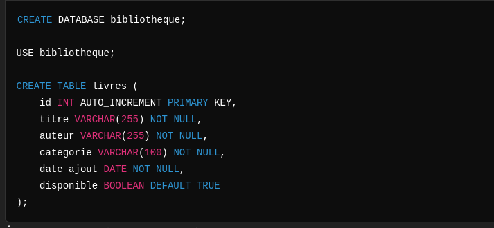
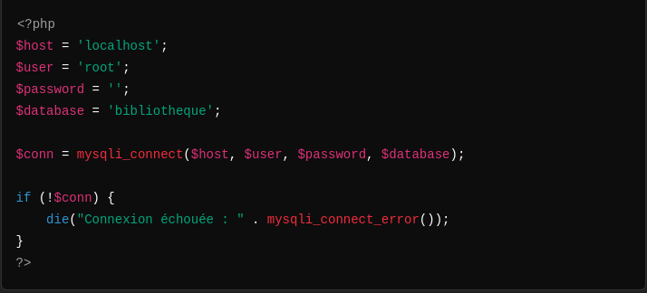

# MySQL Challenge

## Objectifs pédagogiques

- Apprendre à connecter une application PHP à une base de données MySQL en utilisant le driver MySQLi.
- Implémenter les opérations CRUD (Create, Read, Update, Delete) en PHP procédural.
- Comprendre et appliquer les différentes techniques de récupération de données depuis une base de données.
- Comprendre la différence entre include, require, et leurs variantes avec once.

## Durée de l’activité

2h30

## Déroulement de l’activité

### 1. Introduction théorique (30 minutes)

#### Concepts fondamentaux

**Connexion à une base de données avec MySQLi :**

- Création d’une connexion sécurisée.
- Présentation des méthodes MySQLi : procédurale, orientée objet, requêtes préparées.

**Techniques de récupération de données (Data Fetching) :**

- `mysqli_fetch_assoc()` : Récupérer une ligne sous forme de tableau associatif.
- `mysqli_fetch_array()` : Récupérer une ligne sous forme de tableau associatif ou numérique.
- `mysqli_fetch_row()` : Récupérer une ligne sous forme de tableau indexé numériquement.
- `mysqli_fetch_all()` : Récupérer toutes les lignes sous forme de tableau multidimensionnel.
- Quand utiliser chaque méthode ?

**Différence entre include, require, include_once, et require_once :**

- `include` : Inclut un fichier, mais continue l’exécution en cas d’erreur.
- `require` : Inclut un fichier et interrompt l’exécution en cas d’erreur fatale.
- `include_once` : Similaire à include, mais vérifie si le fichier a déjà été inclus pour éviter les doublons.
- `require_once` : Similaire à require, avec vérification d’inclusion unique.

### 2. Étude de cas : Gestion des livres d’une bibliothèque (30 minutes)

**Contexte :**

L’objectif est de gérer les livres disponibles dans une bibliothèque. Chaque livre possède un titre, un auteur, une catégorie, une date d’ajout, et une disponibilité.

**Objectifs :**

- Implémenter un formulaire pour ajouter un nouveau livre.
- Récupérer les livres dans un tableau avec différentes techniques de fetching (`fetch_assoc`, `fetch_row`, etc.).
- Comparer et expliquer les résultats.
- Utiliser include et require pour une meilleure organisation du code (e.g., inclusion du fichier de connexion).

### 3. Activité pratique (1h30)

**Étape 1 : Configuration de la base de données (10 minutes)**

Créer une base de données `bibliotheque` avec une table `livres` :

**Étape 2 : Connexion à la base de données avec MySQLi (10 minutes)**

Créer un fichier `db.php` pour gérer la connexion :

**Étape 3 : Ajout d’un livre avec require_once (20 minutes)**

Créer un fichier `ajouter_livre.php` : ******

**Étape 4 : Récupération et affichage des données (Data Fetching) (40 minutes)**

Créer un fichier `liste_livres.php` : ******

**Étape 5 : Comparaison des méthodes (10 minutes)**

Discuter des avantages/inconvénients des différentes techniques de fetching.

### 4. Mise en commun et correction (20 minutes)

- Présentation des travaux par les groupes.
- Analyse des méthodes utilisées et choix argumentés entre include, require, et leurs variantes.
- Discussion collective sur les meilleures pratiques.

## Livrables attendus

- Un formulaire fonctionnel pour ajouter des livres avec `require_once`.
- Une page listant les livres avec au moins deux techniques de fetching.
- Une explication claire des choix techniques réalisés.

## Évaluation

- Qualité et fonctionnalité du code.
- Argumentation des choix techniques (fetching et inclusion).
- Bonne utilisation des concepts enseignés.
